# Basics of PID controllers

PID controllers are so simple and powerfull that they are everywhere now. They are used in many systems from car cruise control, temperature control to laser locking. Basically if you have any system that you can control, you can plug a PID controller to it and make it to do what you need. And as we are surrounded by them, we need to know how do they work.

Ideally after reading this article you should not only _understand_ how PID controllers work, but also _feel_ them. So you could look at your controller and understand what you need to change to stop oscillations or to speed it up. I will also explain how autotuning works and what exactly happens when you press the magical "autotune" button. There are also a few tricky parts that you need to take into account when implementing such a controller in a real system, I cover a few of these things in the second part.

This writeup is based on my talk in Rinberg castle during our group retreat. Slides are avaliable [here](talk/).

There is also a [web demo](demo/) where you can play with a toy model, change parameters of the system or the controller and see what happens. It is not fully functional yet — it doesn't have autotuning and data filtering, maybe I will add it later.

# Table of contents

- [Ideal controller](#ideal-pid-controller)
	- [Relay controller](#relay-controller)
	- [P-controller](#p-controller)
	- [PI-controller](#pi-controller)
	- [PID-controller](#pid-controller)
	- [Autotuning](#autotuning)
		- [Ziegler–Nichols method](#zieglernichols-method)
		- [Step responce](#step-responce)
		- [Relay method](#relay-method)
	- Ramping
- Implementation issues
	- Limited output and integral part
	- Noize and derivative part
	- Noize and autotuning
	- Filtering noize
		- Mean filter
		- Exponential filter
		- Kalman filter
- Hardware implementation with Arduino

# Ideal PID controller

First let's have a look at the ideal theoretical PID controller. We will be working with this toy model:

Imagine that you are a dragon and you want to cook a knight. To cook him nicely and get ideal taste you need to heat him up to 200°C and keep him at exactly this temperature for 20 minutes.

As we are working in the ideal case, we will imagine that we are not just a simple fire dragon, but instead a fancy fire-and-ice dragon, so we can heat the target or cool it depending on what we want.

## Relay controller

The most simple thing that you can try is to heat if the temperature is below 200°C and cool if we are above the setpoint. Makes sence, but let's see how it will look like:

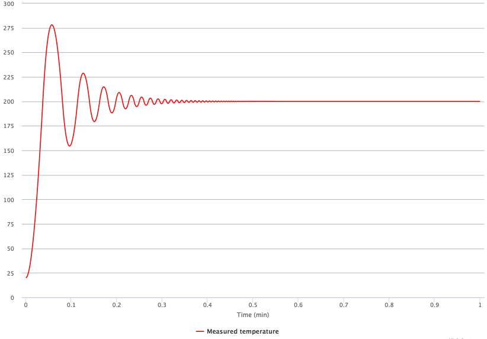

Looks not so bad, at the end we are actually at 200°C. But in the very beginning there is a huge overheat and some oscillations in the temperature that damping with time. After such way of cooking our knight will be probably fried and not very tasty.

Also, taking into account that we are not an infinetely fast dragon and it takes some time to switch between heating and cooling, we will get even worse:

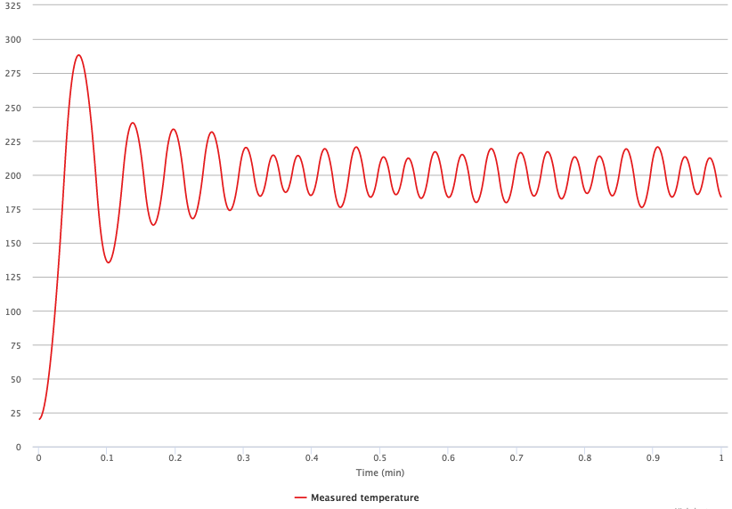

Here you see constant oscillations that never damp in time. We can do better.

## P controller

A smarter way could be to apply heat that will be proportional to the temperature difference between the knight's temperature and our setpoint.

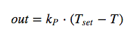

By choosing a reasonable proportional gain _kP_ we can heat up the system without any oscillations:

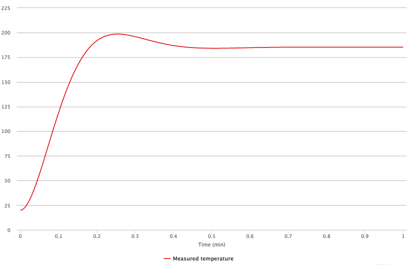

Looks much better already! But we've got another problem — the system is at slightly lower temperature than we need. We could increase a setpoint to overcome this, but it is a bad way of doing that — if properties of the system will change we will end up at some other temperature. We don't want that, so we need to make better.

## PI controller

The problem that we have is very simple - we can't stay at target temperature because at this temperature our ouput will be zero and we can't compensate for the environment that tries to cool our system to the room temperature.

To solve this problem let's add a small integral part to our controller, so if we are constantly below the set point, error will add up and output will get to some value that is enough to compensate cooling from the environment.

Now our output will look like this:

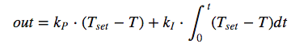

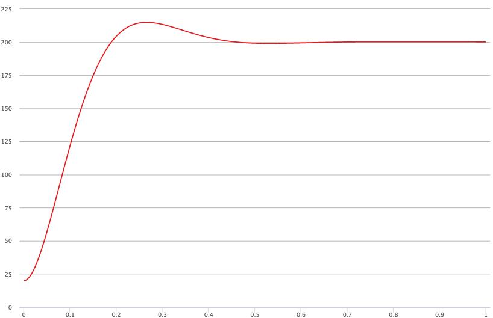

Great! Now we've reached the target temperature and don't have any oscillations! There are two small problems though. First, there is a small overheat in the very beginning, as while we were heating up from 20 to 200 degrees, integral part kept adding up and led to overheat. Another problem is that our controller is slower than the very first one operating in the relay mode. We can solve both of them and get better once again.

## PID controller

We already have proportional and integral parts in the controller, and it would make sense to add differential one. What it does is quite easy to understand — based on current and previous temperatures it predicts the temperature for the next point if we heat at the same pace. So this prediction will help to compensate integral part and avoid overheating. At the same time we could tune parameters to larger values and make our controller faster.

You can probably guess how the output will look like:

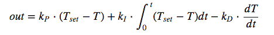

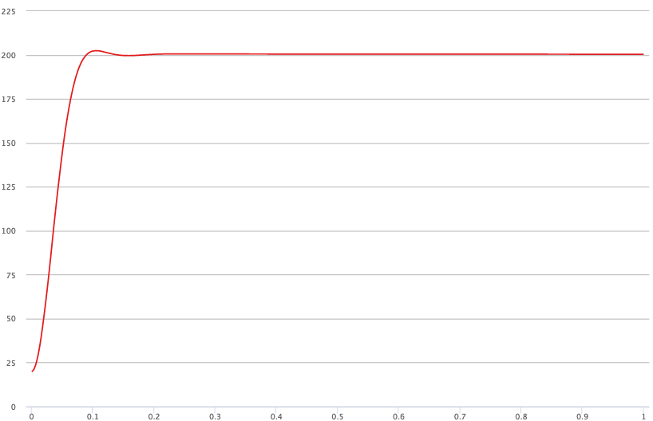

Now it looks exactly like we want — it quickly reaches the exact value of the target temperature, without any oscillations or overheating. Summing up, here how all three controllers look like:

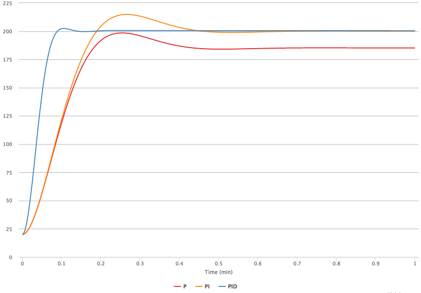

## Autotuning

To obtain a nicely working PID controller is not very simple. You have three parameters that you need to choose wisely — proportional, integral and differential gains. And if parameters are choosen badly you can end up with something like this:

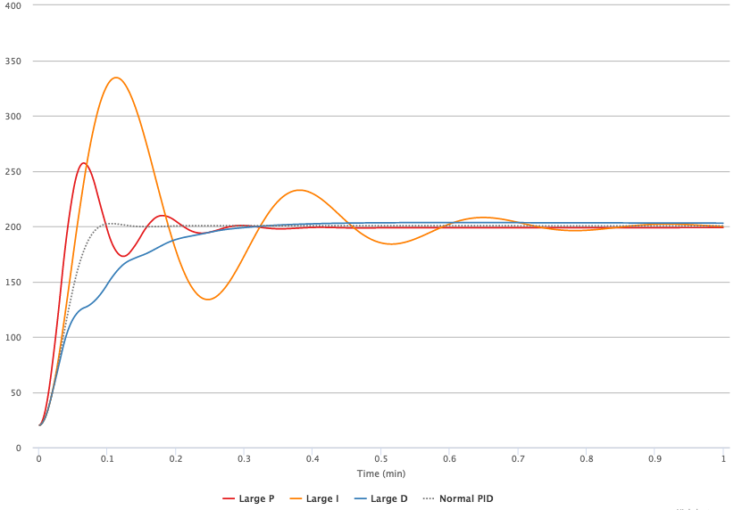

Luckily there are ways to derive more or less optimal parameters for the PID controller by autotuning it. There are algorithms for that. To choose optimal parameters we first need to characterize our system. Basically we need two parameters — how output scales to the temperature difference (i.e. if we change the output by, say, 0.1 how will the temperature of the system change) and some timescale (how fast the temperature responce to changes in the output).

### Ziegler–Nichols method

First method uses system oscillations to get optimal parameters. You need to do the following steps:

- Set all gains to zero
- Start increasing proportional gain
- Keep increasing proportional gain until you get constant oscillations
- Write down the value of proportional gain that caused constant oscillations
- Measure period of these oscillations

Here you can see how the system behaives depending on the value of the proportional gain.

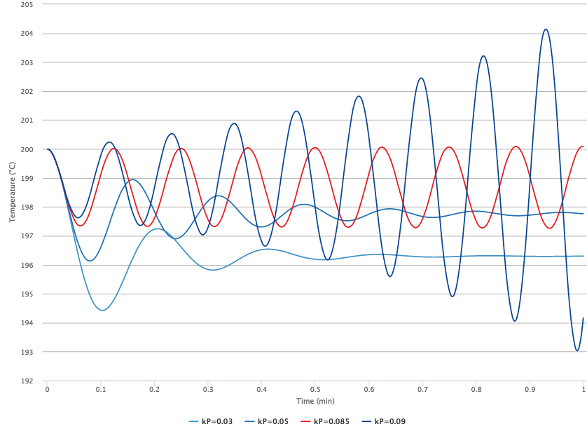

Now having critical proportional gain (kU) and period of oscillations (PU) you can calculate optimal parameters for the controller:

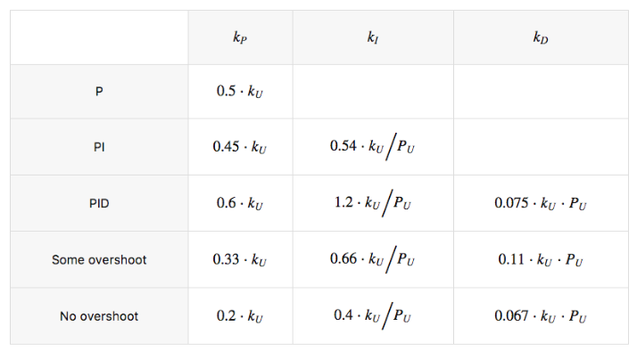

What I don't like about this autotuning method is that you need to make your system unstable. Another annoying part is that it takes increadibly long to autotune temperature controller with this method.

### Step responce

Another method is to get approximately to the setpoint somehow (with badly tuned controller or manually) and then increase the output a bit:

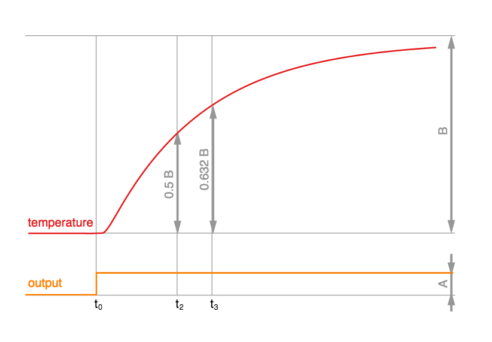

From this responce we can derive optimal parameters as follows:

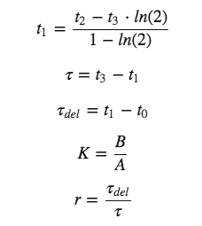

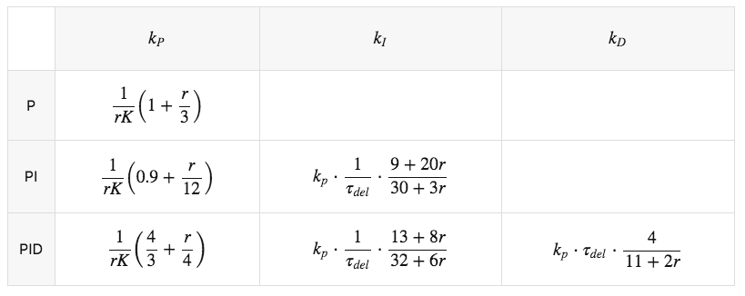

Looks like magic, but it's not. It's just written for engeneers. What you actually have here is an exponential fit of a system responce and derivation of characteristic delay, amplitude and derivative. You can read about it in some control theory book or just think how would you do this — you will come up with similar expressions.

But if you want to implement autotuning in hardware, you probably don't want any complicated computations, so this "magic" values can be used right away.

I personally don't like this technique, as during measurements of the step responce you are loosing control over temperature and if you change output too much, it may heat the system to higher temperature than you expect. Fortunately, there is another way.

### Relay method

A better way to figure out how our system behaves is to make it oscillate and then measure oscillation frequency and amplitude. It is somehow similar to the first method, but you never loose control of your system. We start again in a somehow obtained steady state mode near our point of interest. Then we choose a new setpoint slightly below current temperature and decrease output by some value _D_. When our system crosses the setpoint, we increase the output by _2D_ and so on. Well, figures explain this kind of stuff better than words:

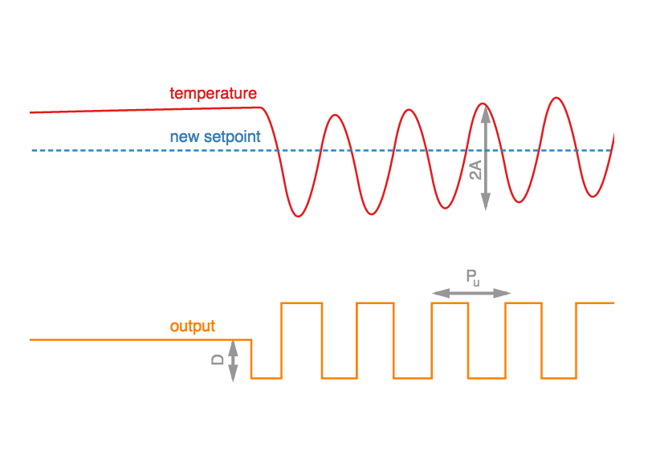

From this data we already have PU period and critical kU can be calculated as follows:

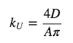

Then you can use the table from the Ziegler–Nichols method to choose optimal parameters for the controller.

This method I find optimal as you have full control of your system and still can get everything you need to tune the controller.

## Ramping

More to go...
