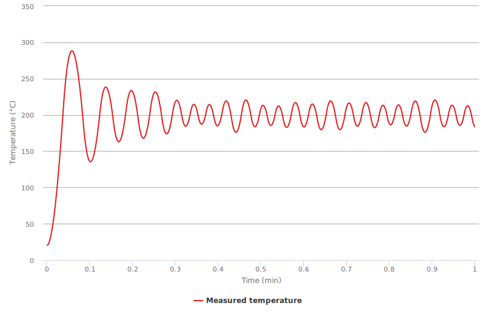
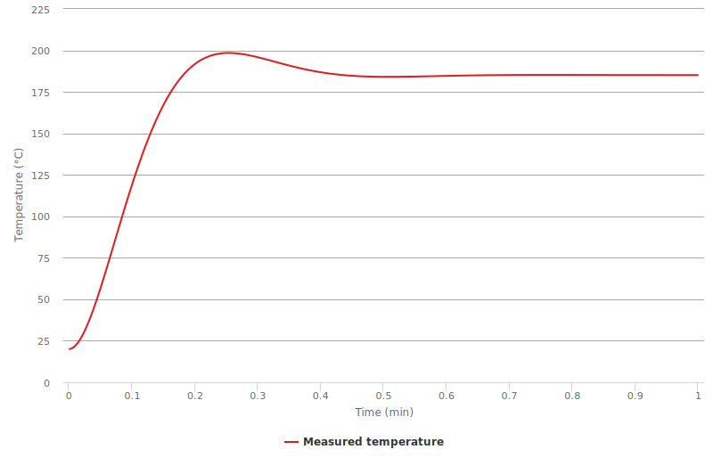
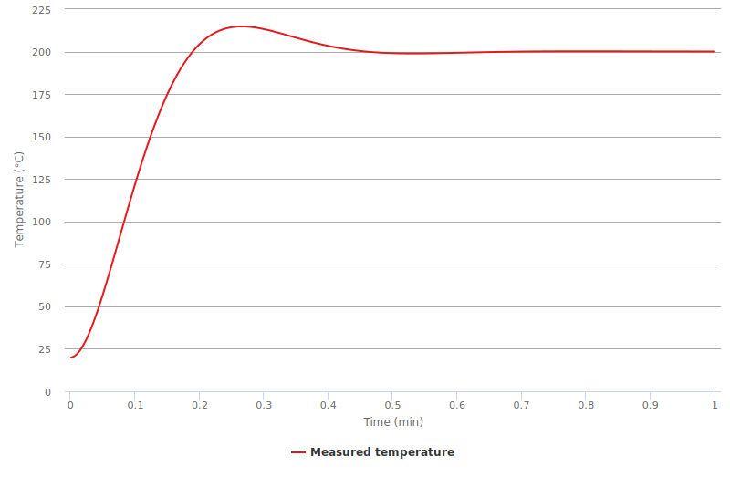
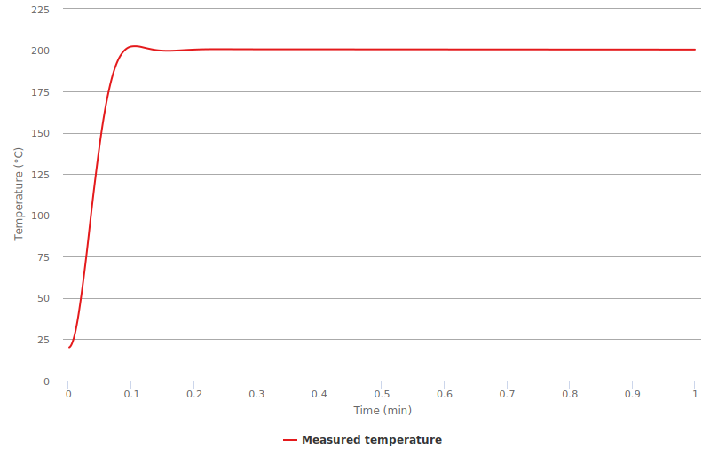
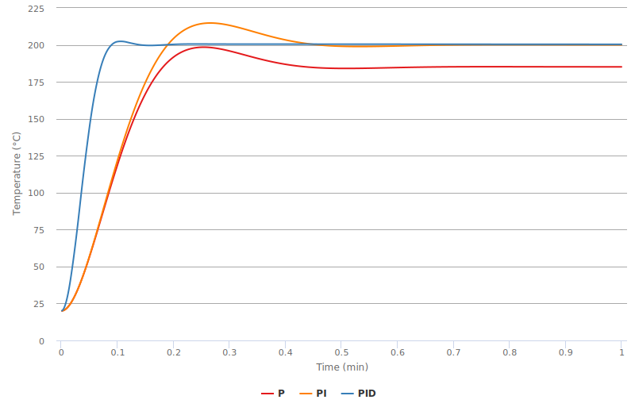

# Basics of PID controllers

PID controllers are so simple and powerfull that they are everywhere now. They are used in many systems from car cruise control, temperature control to laser locking. Basically if you have any system that you can control, you can plug a PID controller to it and make it to do what you need. And as we are surrounded by them, we need to know how do they work.

Ideally after reading this article you should not only _understand_ how PID controllers work, but also _feel_ them. So you could look at your controller and understand what you need to change to stop oscillations or to speed it up. I will also explain how autotuning works and what exactly happens when you press the magical "autotune" button. There are also a few tricky parts that you need to take into account when implementing such a controller in a real system, I cover a few of these things in the second part.

This writeup is based on my talk in Rinberg castle during our group retreat. Slides are avaliable [here](talk/).

There is also a [web demo](demo/) where you can play with a toy model, change parameters of the system or the controller and see what happens. It is not fully functional yet — it doesn't have autotuning and data filtering, maybe I will add it later.

## Table of contents

- Ideal controller
	- Relay controller
	- P-controller
	- PI-controller
	- PID-controller
	- Autotuning
		- Ziegler–Nichols method
		- Step responce method
		- Relay method
	- Ramping
- Implementation issues
	- Limited output and integral part
	- Noize and derivative part
	- Noize and autotuning
	- Filtering noize
		- Mean filter
		- Exponential filter
		- Kalman filter
- Hardware implementation with Arduino

## Ideal PID controller

First let's have a look at the ideal theoretical PID controller. We will be working with this toy model:

Imagine that you are a dragon and you want to cook a knight. To cook him nicely and get ideal taste you need to heat him up to 200°C and keep him at exactly this temperature for 20 minutes.

As we are working in the ideal case, we will imagine that we are not just a simple fire dragon, but instead a fancy fire-and-ice dragon, so we can heat the target or cool it depending on what we want.

### Relay controller

The most simple thing that you can try is to heat if the temperature is below 200°C and cool if we are above the setpoint. Makes sence, but let's see how it will look like:

Looks not so bad, at the end we are actually at 200°C. But in the very beginning there is a huge overheat and some oscillations in the temperature that damping with time. After such way of cooking our knight will be probably fried and not very tasty.

Also, taking into account that we are not an infinetely fast dragon and it takes some time to switch between heating and cooling, we will get even worse:

Here you see constant oscillations that never damp in time. We can do better.

### P controller

A smarter way could be to apply heat that will be proportional to the temperature difference between the knight's temperature and our setpoint.

By choosing a reasonable proportional gain _kP_ we can heat up the system without any oscillations:

Looks much better already! But we've got another problem — the system is at slightly lower temperature than we need. We could increase a setpoint to overcome this, but it is a bad way of doing that — if properties of the system will change we will end up at some other temperature. We don't want that, so we need to make better.

### PI controller

The problem that we have is very simple - we can't stay at target temperature because at this temperature our ouput will be zero and we can't compensate for the environment that tries to cool our system to the room temperature.

To solve this problem let's add a small integral part to our controller, so if we are constantly below the set point, error will add up and output will get to some value that is enough to compensate cooling from the environment.

Now our output will look like this:

Great! Now we've reached the target temperature and don't have any oscillations! There are two small problems though. First, there is a small overheat in the very beginning, as while we were heating up from 20 to 200 degrees, integral part kept adding up and led to overheat. Another problem is that our controller is slower than the very first one operating in the relay mode. We can solve both of them and get better once again.

### PID controller

We already have proportional and integral parts in the controller, and it would make sense to add differential one. What it does is quite easy to understand — based on current and previous temperatures it predicts the temperature for the next point if we heat at the same pace. So this prediction will help to compensate integral part and avoid overheating. At the same time we could tune parameters to larger values and make our controller faster.

You can probably guess how the output will look like:

Now it looks exactly like we want — it quickly reaches the exact value of the target temperature, without any oscillations or overheating. Summing up, here how all three controllers look like:

## The rest will appear later.
